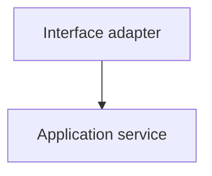

---
orderspec:
  artifact: command_prompt
  command: order.plan
  phase: plan
description: Map the spec's logical architecture onto the current repository state — physical structure, verified stack, path manifest, and mechanism machine state.
handoffs:
  - label: Create Tasks
    agent: order.tasks
    prompt: Break the plan into tasks
    send: true
---

## User Input

```text
$ARGUMENTS
```

You **MUST** consider the user input before proceeding if not empty.

## Role of This Artifact

`plan.md` answers **WHERE and HOW**: it maps the stable contract in `spec.md` onto the **current physical state of the repository**.

Properties:

- **Regenerable**: derived from `spec.md` + actual repository state. If the repo changes, re-run this command. Do not edit `spec.md` to fit the code.
- **Non-duplicating**: reference stable Spec IDs (`REQ-`, `IF-`, `AC-`, `INV-`, `EDGE-`, `NFR-`, `CON-`) instead of copying contract text. Do not restate the Executive Summary. Do not redraw spec logical diagrams.
- **Concrete**: exact repo-relative files, verified stack facts, verified test/build commands, and physical implementation mapping.
- **Mechanism-aware**: implementation mechanism decisions are written to machine state (`.state/mechanisms.tsv`) through `traceability.py put-mechanisms`, not mirrored as a Markdown table in `plan.md`.

`spec.md` remains the source of truth for **WHAT** and logical architecture. `plan.md` is a repo snapshot for **WHERE/HOW**.

## Contract Drift Guard

During planning, you MUST NOT introduce new externally visible behavior unless it is explicitly present in `spec.md`.

Forbidden additions unless already specified:

- new API endpoints;
- new request/response shapes;
- new status codes;
- new fields or enums;
- new permissions, roles, RBAC rules, tenant semantics, or authorization behavior;
- retention policies, TTLs, background jobs, feature flags, environment variables;
- new non-functional targets or scale numbers;
- alternative error semantics that differ from §9 Interface Contracts or §12 Acceptance Criteria.

Allowed additions:

- internal mechanisms required to satisfy existing Spec IDs;
- physical file/module mapping;
- test file mapping;
- verified dependency/version facts from the repository;
- implementation choices that do not change externally observable behavior.

If a necessary implementation decision would change the contract, STOP and report:

```text
PLAN_BLOCKED: contract decision required
```

Include:

- the conflicting Spec IDs;
- the proposed decision;
- why it changes observable behavior;
- route: `/order.spec`.

Do not silently compensate for an incomplete or contradictory spec.

## Command Context Bootstrap

Before starting command-specific logic:

1. Resolve command context:

   ```bash
   python3 .orderspec/framework/scripts/command_context.py resolve order.plan --json
   ```

2. If `ok` is `false` or `missing_required` is non-empty, STOP and report the missing required context.
3. Read every file returned in `to_read`, in returned order.
4. Interpret each file according to its `usage` field:
   - `apply`: apply as procedural command/framework/template rules.
   - `constrain`: enforce as project constraints only.
   - `parse`: parse as structured config or runtime state.
   - `inspect`: inspect as command input/output artifact.
   - `reference`: use only as reference or evidence.
5. Do not manually load additional framework rules, protocols, configuration files, project contracts, templates, or runtime state before the main command logic unless they are returned by `command_context.py`.

Project contracts returned with `usage: "constrain"` constrain this command, but do not override framework rules.

If required project contracts are missing, STOP and tell the user:

> Project contracts not found or incomplete. Run `/order.bootstrap` first to create or repair `constitution.md`, `stack.md`, `architecture.md`, and `conventions.md`.

## Pre-Execution Checks

No operator-defined pre-execution extension phases are supported in the current OrderSpec core.

Complete Command Context Bootstrap before mode detection.

## Script Availability Checks

Before any mutation, verify these framework scripts exist when their step is needed:

| Script | Required for |
|---|---|
| `.orderspec/framework/scripts/setup.py` | path resolution and plan template setup |
| `.orderspec/framework/scripts/upstream_gate.py` | checking upstream spec gate status |
| `.orderspec/framework/scripts/traceability.py` | mechanism matrix writes and mechanical validation |
| `.orderspec/framework/scripts/validate_tooling.py` | deterministic `tooling.json` and installed skills validation |

If a required script is missing, STOP and report the missing script. Do not manually replace script-owned mechanics.

## Mode Detection

Determine mode before writing any managed file.

Read-only operations allowed during mode detection:

- command context resolution;
- reading files returned by resolver;
- reading `$ARGUMENTS`;
- running `setup.py paths --json`;
- reading an existing `plan.md` only after the target feature is resolved;
- checking whether target files exist.

Do not create directories, write `plan.md`, update active feature state, or run traceability writers during mode detection.

### Modes

1. **Regenerate** — active non-template `spec.md` exists, and `plan.md` needs to be recreated from the current repo state.
2. **Refine** — active `plan.md` exists, and the request changes specific mechanisms or paths without changing the spec contract.

State the detected mode in one line before proceeding.

## Resolve Feature Paths

Before any gate or setup that may write files, resolve the active feature paths.

```bash
PATHS_JSON="$(python3 .orderspec/framework/scripts/setup.py paths --json)"
FEATURE_DIR="$(python3 -c 'import json,sys; print(json.load(sys.stdin)["FEATURE_DIR"])' <<< "$PATHS_JSON")"
FEATURE_SPEC="$(python3 -c 'import json,sys; print(json.load(sys.stdin)["FEATURE_SPEC"])' <<< "$PATHS_JSON")"
IMPL_PLAN="$(python3 -c 'import json,sys; print(json.load(sys.stdin)["IMPL_PLAN"])' <<< "$PATHS_JSON")"
REPO_ROOT="$(python3 -c 'import json,sys; print(json.load(sys.stdin)["REPO_ROOT"])' <<< "$PATHS_JSON")"
FEATURE="$(basename "$FEATURE_DIR")"
```

### Shell Variable Persistence Warning

Tool shell sessions may not preserve variables across separate invocations.

Do not assume `FEATURE_DIR`, `FEATURE_SPEC`, `IMPL_PLAN`, `REPO_ROOT`, or `FEATURE` remain available in later shell calls.

Every shell block that uses these variables MUST either:

1. rehydrate them from `setup.py paths --json`; or
2. execute all dependent commands inside the same compound shell invocation.

If `setup.py paths --json` fails because no active feature directory can be resolved, STOP:

```text
PLAN_STOPPED: no active feature
No feature directory is active. A plan maps an existing spec.md onto the codebase.
  1. Create/select a feature with /order.spec
  2. Then run /order.plan
```

## Upstream Gate Guard

A plan must not ignore a known failed upstream contract gate. Gates are optional, so absence of a gate report is advisory, but an existing non-PASS report must be respected unless the user explicitly forces planning.

Run:

```bash
PATHS_JSON="$(python3 .orderspec/framework/scripts/setup.py paths --json)"
FEATURE_DIR="$(python3 -c 'import json,sys; print(json.load(sys.stdin)["FEATURE_DIR"])' <<< "$PATHS_JSON")"
FEATURE_SPEC="$(python3 -c 'import json,sys; print(json.load(sys.stdin)["FEATURE_SPEC"])' <<< "$PATHS_JSON")"

FORCE_FLAG=""
case "$ARGUMENTS" in
  *"--force"*) FORCE_FLAG="--force" ;;
esac

python3 .orderspec/framework/scripts/upstream_gate.py \
  --report        "$FEATURE_DIR/spec-report.md" \
  --artifact      "$FEATURE_SPEC" \
  --upstream-name "spec.md" \
  --this          "/order.plan" \
  --build         "/order.spec" \
  --fix           "/order.spec" \
  --recheck       "/order.spec-check" \
  $FORCE_FLAG
```

Act on the result by exit code / `status`:

- **exit 2, `status: stop`** → STOP. Produce no plan. There is no `spec.md` to build from. `--force` does not override this.
- **exit 1, `status: halt`** → STOP. Produce no plan. The contract has unresolved gate findings. Do not run setup, do not read the repository.
- **exit 0, `status: forced`** → proceed, but insert this line as the first non-title warning in `plan.md`:

  ```markdown
  > ⚠ Built over non-PASS spec gate (verdict: {verdict}) via --force
  ```

  If status is not `forced`, do not insert any forced-warning text, placeholder, or HTML comment.

- **exit 0, `status: advisory`** → emit the `reason` as a one-line warning and proceed.
- **exit 0, `status: ok`** → proceed silently.

### STOP message: missing artifact

```text
PLAN_STOPPED: no spec to plan from
There is no spec.md in this feature ({FEATURE_DIR}).
A plan maps an existing contract onto the codebase — it cannot be built first.
  1. Create the contract:  /order.spec "<your feature description>"
  2. Recommended:          /order.spec-check
  3. Then run:             /order.plan
--force does NOT bypass this — there is genuinely nothing to plan.
```

### HALT message: upstream gate not passed

```text
PLAN_BLOCKED: spec gate not passed
Spec gate verdict: {verdict} (from spec-report.md, dated {date})
The contract has unresolved findings. Resolve them first:
  1. Action each Routing block in spec-report.md via /order.spec "..."
  2. Re-run /order.spec-check until the verdict is ✅ PASS
  3. Then re-run /order.plan
To build the plan anyway (NOT recommended), re-run with --force.
```

## Self Gate Report Intake

Before regenerating `plan.md`, check whether a previous `/order.plan-check` report exists.

```bash
PATHS_JSON="$(python3 .orderspec/framework/scripts/setup.py paths --json)"
FEATURE_DIR="$(python3 -c 'import json,sys; print(json.load(sys.stdin)["FEATURE_DIR"])' <<< "$PATHS_JSON")"
SELF_REPORT="$FEATURE_DIR/plan-report.md"
test -e "$SELF_REPORT" && echo "SELF_REPORT_PRESENT" || echo "SELF_REPORT_ABSENT"
```

- **SELF_REPORT_ABSENT** → no prior gate run for this artifact. Proceed normally.
- **SELF_REPORT_PRESENT** → read the report and parse its header verdict:
  - **✅ PASS** → previous artifact was clean. Ignore the report as a fix-source; proceed with `$ARGUMENTS` only.
  - **⛔ BLOCK** or **🔀 ROUTING REQUIRED** → this is the authoritative list of defects this command must resolve.

If the report is BLOCK/ROUTING REQUIRED:

1. Read the **Routing Required** section and Findings table.
2. Address every finding whose `Run` line targets `/order.plan`.
3. Findings targeting another command are not yours. Do not silently compensate.
4. If an upstream-owned finding blocks a plan fix, STOP:

   ```text
   PLAN_BLOCKED: upstream finding must be resolved first
   ```

   List finding IDs and owning commands.

5. Treat `$ARGUMENTS` as additional guidance, never a replacement.
6. Record addressed finding IDs in the Completion Report.

After successful write and successful self-checks, if a BLOCK/ROUTING REQUIRED report was used:

1. Replace `plan-report.md` with a `CONSUMED_STALE` marker.
2. The marker MUST say this is **not PASS**.
3. It MUST say the previous report was consumed by `/order.plan`.
4. It MUST say `/order.plan-check` is required for a fresh verdict.

## Mechanisms Are Machine State, Not Document Prose

Mechanism decisions for this feature live in machine state:

```text
<feature-dir>/.state/mechanisms.tsv
```

They do **not** live as a table inside `plan.md`.

Hard rules:

- You MUST NOT author, hand-edit, or mirror a mechanism table in `plan.md`.
- The only writer of `mechanisms.tsv` is `traceability.py put-mechanisms`.
- `put-mechanisms` prepends the contract header, lints rows, and writes atomically.
- If lint rejects the data, fix the emitted rows and re-run. Never hand-write the file.
- Downstream `/order.tasks` reads mechanisms via script/machine state, not from prose.

### Required mechanism rows

The mechanism matrix MUST contain exactly one row for each active spec ID with these prefixes:

- Always required: `REQ`, `IF`, `AC`, `EDGE`, `INV`, `NFR`
- Conditional: `ASM` only if it records a deferred implementation decision or persisted shape decision
- Never required: `SC`, `CON`, `UJ`, `Q`

If an ID is verified through another ID's executable path, use `delegated:<spec_id>`.

If an ID has no executable implementation task by design, use `documented`.

### `mechanisms.tsv` row contract

Emit one data row per spec ID. No header. Tab-separated. Exactly five columns:

```text
spec_id<TAB>coverage_kind<TAB>mechanism<TAB>primary_files<TAB>test_type
```

Columns:

- `spec_id`: exactly one ID, e.g. `REQ-001`.
- `coverage_kind`:
  - `direct`
  - `documented`
  - `delegated:<spec_id>`
- `mechanism`: short concrete implementation decision. Non-empty.
- `primary_files`: exactly one repo-relative file, forward-slash, no spaces.
- `test_type`:
  - `unit`
  - `integration`
  - `documented`

Lint-enforced invariants:

| coverage_kind | Meaning | Required test_type |
|---|---|---|
| `direct` | executable test exercises this ID | `unit` or `integration` |
| `documented` | asserted by plan/spec documentation, no executable task should exercise it | `documented` |
| `delegated:<ID>` | coverage is provided by another ID's mechanism | `unit` or `integration` |

Additional rules:

- `primary_files` contains exactly one file, not a `;`-separated list.
- `SC`, `CON`, `UJ`, and `Q` must not have mechanism rows.
- `delegated:<ID>` target must exist and must not form a cycle.
- For `direct` and `delegated:*`, `primary_files` must appear in the `pathmanifest`.
- For `documented`, `primary_files` should be `plan.md` unless a separate documentation file is explicitly listed in the `pathmanifest`.

### Documented coverage guidance

Use `documented` sparingly.

Appropriate:

- explicit design decision with no executable behavior;
- non-functional note that cannot be meaningfully asserted in this repo;
- compatibility or policy statement recorded in `plan.md`.

Suspicious and usually wrong:

- `documented` pointing to a new implementation `.js`/`.py`/source file;
- executable behavior described as documented;
- invariant that can be tested through service/API behavior.

For `documented` rows, use:

```text
primary_files = plan.md
test_type = documented
```

Do not point documented rows at implementation source files unless the file is an existing documentation-only artifact. Source files imply executable behavior and should use `direct` or `delegated:<ID>`.

If an implementation file is the primary file, strongly prefer `direct` or `delegated:<ID>`.

## Tooling and Skills Verification

Tooling protocol and configuration are loaded via Command Context Bootstrap.

For all tooling and documentation verification decisions, you MUST follow the **Documentation Evidence and Tooling Policy** in `.orderspec/framework/orderspec-rules.md`.

Do not duplicate or reinterpret those global rules in this prompt.

### Run deterministic skill validation

Before planning library-specific mechanisms, run:

```bash
python3 .orderspec/framework/scripts/validate_tooling.py -C "$PWD" --json
```

Store the JSON output for use during planning. Interpret it strictly according to the global policy.

### Evidence recording

Record tooling evidence in `plan.md` under `## Library Documentation Evidence` as required by the global policy.

Do not invent APIs, options, middleware order, driver return shapes, or config syntax without evidence.

## Outline

### 1. Setup plan artifact

Run setup with template refresh. `plan.md` is regenerable; do not patch stale generated prose.

```bash
SETUP_JSON="$(python3 .orderspec/framework/scripts/setup.py plan --json --refresh-template)"
FEATURE_DIR="$(python3 -c 'import json,sys; print(json.load(sys.stdin)["FEATURE_DIR"])' <<< "$SETUP_JSON")"
FEATURE_SPEC="$(python3 -c 'import json,sys; print(json.load(sys.stdin)["FEATURE_SPEC"])' <<< "$SETUP_JSON")"
IMPL_PLAN="$(python3 -c 'import json,sys; print(json.load(sys.stdin)["IMPL_PLAN"])' <<< "$SETUP_JSON")"
REPO_ROOT="$(python3 -c 'import json,sys; print(json.load(sys.stdin)["REPO_ROOT"])' <<< "$SETUP_JSON")"
FEATURE="$(basename "$FEATURE_DIR")"
```

If setup fails because `spec.md` is missing, STOP with `PLAN_STOPPED: no spec to plan from`.

### 2. Load context

Read:

- `FEATURE_SPEC`;
- resolved `plan-template.md` already copied to `IMPL_PLAN`;
- prior `plan-report.md` if intake requires it.

Run deterministic tooling validation:

```bash
python3 .orderspec/framework/scripts/validate_tooling.py -C "$PWD" --json
```

Store the JSON output for use during planning. Do not manually inspect `.orderspec/skills/`.

Read registered spec IDs from machine state:

```bash
python3 .orderspec/framework/scripts/traceability.py -C "$PWD" --feature-dir "$FEATURE_DIR" get spec-ids
```

If this fails because `spec-ids.tsv` is missing, recover mechanically:

```bash
python3 .orderspec/framework/scripts/traceability.py -C "$PWD" --feature-dir "$FEATURE_DIR" init
python3 .orderspec/framework/scripts/traceability.py -C "$PWD" --feature-dir "$FEATURE_DIR" extract-spec-ids
python3 .orderspec/framework/scripts/traceability.py -C "$PWD" --feature-dir "$FEATURE_DIR" get spec-ids
```

Do not hand-write or hand-read `spec-ids.tsv`.

### 3. Focused repository reconnaissance

Perform a focused repository scan before filling the plan. Use the smallest file set sufficient to map `spec.md` onto the current codebase.

#### Read budget

Hard cap: read at most:

- one dependency manifest;
- one entrypoint or route-registration file;
- one exemplar per touched implementation layer;
- shared utilities/middlewares/plugins explicitly named by `CON-NNN`;
- test setup/configuration;
- one analogous test file per relevant test type.

If total exceeds approximately 12 files, you are probably over-reading. Prefer representative exemplars over exhaustive scans.

Read more only if first-pass evidence is insufficient. If you read additional files, record why in `Verified Against`.

#### What to verify

Verify:

- language/runtime versions;
- framework/library versions;
- package manager;
- test/lint/build commands;
- source layout;
- module boundaries;
- route mounting style;
- model/entity/persistence conventions;
- validation/request schema conventions;
- service/business logic conventions;
- test naming and location conventions;
- repository evidence for every `CON-NNN`;
- implementation mechanisms for `REQ`, `IF`, `AC`, `EDGE`, `INV`, `NFR`.

If repository evidence contradicts `spec.md`, STOP:

```text
PLAN_BLOCKED: repository contradicts spec
```

List:

- evidence file(s);
- conflicting Spec IDs;
- route to `/order.spec` if the contract must change.

#### Naming convention verification

For each affected layer:

- cite at least two observed filenames when available;
- record case style and suffix pattern;
- every `[NEW]` path must follow verified or explicitly justified convention;
- do not cite variable names, schema field names, functions, classes, or single-word filenames as multi-word filename evidence.

For multi-word new filenames, apply first matching rule:

1. same-layer multi-word filename precedent;
2. cross-layer multi-word filename precedent;
3. repo config-filename casing;
4. ecosystem default.

If rule 1 fails, explicitly write:

```text
No same-layer multi-word precedent found; rule fired: <N>; chosen convention: ...
```

### 4. Fill `plan.md`

Rewrite `IMPL_PLAN` from the refreshed template.

Required sections:

1. `Summary`
2. `Technical Context & Stack Verification`
3. `Constitution Check`
4. `Feature Artifacts Layout`
5. `Physical Project Structure`
6. `Structure & Path Decisions`
7. `Mechanism Matrix` notice
8. `Complexity Tracking`

Rules:

- Do not generate `data-model.md`, `contracts/`, or `quickstart.md`.
- Do not duplicate §8 Information Model or §9 Interface Contracts from `spec.md`.
- Reference section headings and Spec IDs instead.
- Do not include placeholder rows.
- Do not include a Markdown mechanism table.
- Do not include `TODO`, `???`, `<placeholder>`, or `[path/to/...`.

#### Summary

Write 2–4 sentences of technical approach only. Do not restate `spec.md` Executive Summary.

#### Technical Context & Stack Verification

Fill with verified facts only.

If a fact cannot be verified from the repository, write a precise statement such as:

```text
No test command found in inspected manifests
```

Do not write vague `NEEDS CLARIFICATION` in final `plan.md`.

#### Constitution Check

Evaluate top-level constitution principles.

Status rules:

- `PASS`: verifiable against current existing repo state.
- `DESIGN-OK`: planned implementation complies but code/files do not exist yet.
- `FAIL`: plan violates a principle.

Never mark `PASS` for properties of planned `[NEW]` files.

If `FAIL` is unjustified, STOP. If justified, explain in `Complexity Tracking`.

#### Physical Project Structure

Emit a flat `pathmanifest` fenced block:

```pathmanifest
src/example/new_file.py      [NEW]
src/example/existing.py      [MOD]
tests/example/test_new.py    [NEW]
```

Rules:

- one file per line;
- never list directories;
- `[NEW]` means file does not exist now;
- `[MOD]` means file exists now;
- verify with filesystem existence, not role inference;
- paths are repo-relative, forward-slash, no leading `./`.

Registration/barrel/index/route-mount files that must be touched are common traps: verify each with filesystem existence before tagging `[MOD]`.

Each new service/business-logic file should have a corresponding planned unit test file in the manifest unless explicitly justified in Structure & Path Decisions.

Each externally observable interface from `IF-NNN` should have planned integration coverage unless explicitly delegated/documented in mechanisms.

#### Route path preservation

For every `IF-NNN`, preserve the externally visible path and method from `spec.md`.

If a route module is split for implementation convenience, explicitly state how it is mounted so the external path remains unchanged.

Example:

```text
audit-log.route.js is imported by task.route.js and mounted under /tasks/:taskId/audit.
It is not mounted as /audit-logs.
```

If preserving the spec path conflicts with repository routing conventions, STOP with:

```text
PLAN_BLOCKED: route contract decision required
```

#### Structure & Path Decisions

Fill:

- target folders;
- naming convention evidence;
- architectural mapping from logical roles/Spec IDs to physical files;
- one internal component diagram.

The component diagram must show physical/internal decomposition only. Do not redraw spec logical diagrams.

Use quoted Mermaid labels:



### 5. Emit mechanism matrix to machine state

Build mechanism rows for required prefixes.

Use registered Spec IDs from `spec-ids.tsv` and `spec.md` context. For every required ID, decide:

- coverage kind;
- concrete mechanism;
- single primary file;
- test type.

#### Test topology consistency

Mechanism `test_type` must match the planned test topology.

Rules:

- If any row uses `test_type=unit`, the `pathmanifest` SHOULD include a plausible unit test file for that implementation layer.
- If a service mechanism is marked `unit`, plan a service unit test unless the repository clearly does not use service unit tests and integration coverage is intentionally chosen instead.
- If a validation mechanism is marked `unit`, plan a validation unit test or change the mechanism to `integration` if validation is only exercised through HTTP tests.
- Every externally visible `IF-NNN` should have integration coverage, directly or through delegated `AC-NNN`.

Do not mark rows as `unit` just because the primary file is small. The planned test file topology must support the claim.

Examples:

```bash
printf '%s\n' \
  "REQ-001	direct	validate credentials in auth service	src/services/auth.service.js	unit" \
  "IF-001	direct	HTTP route mounted through auth router	src/routes/auth.route.js	integration" \
  "AC-001	delegated:IF-001	acceptance covered through IF-001 integration path	src/routes/auth.route.js	integration" \
  "INV-001	direct	unique active session check in persistence adapter	src/models/session.model.js	integration" \
  "NFR-001	documented	performance budget noted for implementer; no executable assertion	plan.md	documented" \
| python3 .orderspec/framework/scripts/traceability.py -C "$PWD" --feature-dir "$FEATURE_DIR" put-mechanisms
```

Rows must contain literal tabs between fields.

If `put-mechanisms` exits non-zero:

1. Read stderr.
2. Fix rows.
3. Re-run.
4. Do not hand-edit `mechanisms.tsv`.

Then run:

```bash
python3 .orderspec/framework/scripts/traceability.py -C "$PWD" --feature-dir "$FEATURE_DIR" lint
python3 .orderspec/framework/scripts/traceability.py -C "$PWD" --feature-dir "$FEATURE_DIR" check-mechanisms
```

Both must pass before completion.

### 6. Self-check mechanically

Run:

```bash
python3 .orderspec/framework/scripts/traceability.py -C "$PWD" --feature-dir "$FEATURE_DIR" check-plan
python3 .orderspec/framework/scripts/traceability.py -C "$PWD" --feature-dir "$FEATURE_DIR" validate --stage plan --json
python3 .orderspec/framework/scripts/traceability.py -C "$PWD" --feature-dir "$FEATURE_DIR" summarize-mechanisms --json
```

Blocking findings:

- `M5`: `plan.md` cites an ID not defined by `spec.md`/`spec-ids.tsv`.
- `M9`: pathmanifest missing or malformed.
- `M10`: `[NEW]`/`[MOD]` contradicts filesystem.
- `M15`: missing or invalid mechanism rows.
- `M16`: mechanism primary file not listed in pathmanifest.
- `M17`: invalid delegation chain/cycle.
- `M27`: mechanism row references unknown Spec ID.

Medium/low findings must be fixed if meaning-preserving and local. If fixing requires contract change, STOP and route to `/order.spec`.

## Post-Execution Checks

No operator-defined post-execution extension phases are supported in the current OrderSpec core.

## Consumed Report Marker

If a BLOCK/ROUTING REQUIRED `plan-report.md` was used, replace it after successful self-checks with:

```markdown
# CONSUMED_STALE — plan-report.md

This is not a PASS verdict.

The previous `/order.plan-check` report was consumed by `/order.plan` and is now stale.
Run `/order.plan-check` for a fresh verdict.
```

## Completion Report

Report to chat:

- branch;
- `FEATURE_DIR`;
- `IMPL_PLAN`;
- whether `research.md` was generated;
- constitution status summary;
- `[NEW]` file count;
- `[MOD]` file count;
- mechanism matrix result:
  - `put-mechanisms` exited zero;
  - `lint` exited zero;
  - `check-mechanisms` exited zero;
  - row counts from `summarize-mechanisms --json`, not manual counting;
- `check-plan` result;
- `validate --stage plan` result;
- prior `plan-report.md` findings addressed, if any;
- readiness for `/order.tasks`.

## Done When

This self-check is for the generator only. Do not copy it into `plan.md`.

- [ ] Command context resolved via `command_context.py`
- [ ] Every `to_read` file was read and interpreted by `usage`
- [ ] Mode detected and stated
- [ ] No hooks or operator-defined extension phases executed
- [ ] Feature paths resolved via `setup.py paths`; no `jq` used.
- [ ] Upstream gate respected: `ok`/`advisory`/`forced`, not `halt`/`stop`.
- [ ] On forced upstream gate, warning stamped at top of `plan.md`.
- [ ] `plan.md` regenerated from current template via `setup.py plan --json --refresh-template`.
- [ ] Prior `plan-report.md` consumed if present and owned findings addressed.
- [ ] No contract drift introduced.
- [ ] Repository reconnaissance stayed focused and cited only files that affected planning decisions.
- [ ] Technical context, constitution check, pathmanifest, naming evidence, architectural mapping, and component diagram are filled.
- [ ] `validate_tooling.py --json` was run and skill availability was determined deterministically.
- [ ] Tooling evidence recorded in `plan.md` under `## Library Documentation Evidence` (or "No library-specific claims" if none).
- [ ] `pathmanifest` lists files only; every line has exactly one `[NEW]` or `[MOD]`.
- [ ] Mechanism rows emitted through `traceability.py put-mechanisms`; no mechanism table authored in `plan.md`.
- [ ] `traceability.py lint` passes.
- [ ] `traceability.py check-mechanisms` passes.
- [ ] `traceability.py check-plan` passes.
- [ ] `traceability.py validate --stage plan` has no blocking findings.
- [ ] `traceability.py summarize-mechanisms --json` was used for row counts.
- [ ] If a BLOCK/ROUTING `plan-report.md` was used, it was replaced with `CONSUMED_STALE`.
- [ ] Completion Report provided.
