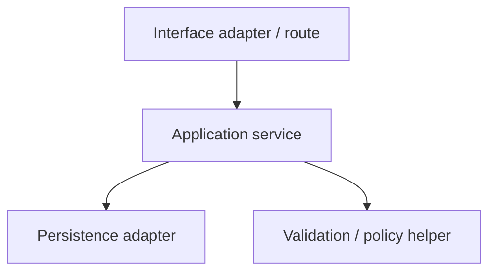

# Implementation Plan: [FEATURE]

**Branch**: `[###-feature-name or "not detected"]`  
**Date**: [DATE]  
**Spec**: [`spec.md`](spec.md)

**Input**: Feature specification from `spec.md`

## Summary

[Technical approach only. Do NOT restate the Executive Summary from `spec.md`. Reference Spec IDs where useful.]

---

## Technical Context & Stack Verification

| Item | Verified Value |
|------|----------------|
| **Language/Version** | [Verified runtime/language version, or "No runtime version found in inspected manifests"] |
| **Primary Dependencies** | [Specific libraries/frameworks already present or planned because of `CON-NNN`] |
| **Storage** | [Target storage layer/tables/collections/files affected; reference Spec §8 logical model or IDs only] |
| **Testing Framework** | [Verified test framework and style] |
| **Target Platform** | [Verified platform/runtime target] |
| **Test/Build Commands** | [`command` from repository manifest/scripts, or "No command found in inspected manifests"] |
| **Constraints Honored** | [`CON-NNN`, `CON-NNN`; flag any conflict] |
| **NFR Focus** | [`NFR-NNN`, `NFR-NNN`; IDs only, no copied text] |
| **Verified Against** | [`file1`, `file2`, ... files actually read that changed a planning decision] |

---

## Constitution Check

<!--
Status values:
- PASS: verifiable against existing repository state right now.
- DESIGN-OK: planned implementation complies, but files/code do not exist yet or enforcement happens during implementation.
- FAIL: plan violates a constitution gate; justify in Complexity Tracking or STOP if unjustified.

Granularity:
- One row per top-level constitution principle.
- Split sub-clauses only when their status differs from the principle's majority status.
-->

| Principle | Status | Evidence | Notes |
|-----------|--------|----------|-------|
| [Principle I] | [PASS / DESIGN-OK / FAIL] | [Repo evidence or planned design evidence] | [Short note] |

---

## Feature Artifacts Layout

```text
[feature-directory]/
├── spec.md              # Source of truth: WHAT contract and logical architecture
├── plan.md              # This file: physical mapping to current repository state
├── research.md          # Conditional: generated only if planning research was required
└── tasks.md             # Generated later by /order.tasks
```

[If no research was needed, write exactly:]

`No research.md generated — all planning inputs were resolved from spec.md and repository reconnaissance.`

---

## Physical Project Structure

<!--
Flat path manifest — NOT a tree.

Rules:
- One FILE per line.
- Never list directories.
- Format: <repo-relative-path>  [NEW]|[MOD]
- [NEW] = file does NOT exist on disk now.
- [MOD] = file DOES exist on disk now.
- Paths are repo-relative, forward-slash, no leading ./.
- This block is machine-checked by traceability.py check-plan and validate --stage plan.
-->

```pathmanifest
src/example/new_file.py      [NEW]
src/example/existing.py      [MOD]
tests/example/test_new.py    [NEW]
```

---

## Structure & Path Decisions

### Target Folders

- **[Folder / Layer]**: [Why this folder/layer is affected]
- **[Folder / Layer]**: [Why this folder/layer is affected]

### File Naming Convention Evidence

<!--
Use only observed filenames as evidence.
Do not cite variable names, schema field names, class names, or single-word files as multi-word naming evidence.
-->

| Layer | Observed Files | Convention | New Files | Rule Fired |
|-------|----------------|------------|-----------|------------|
| Models / Entities | [`...`, `...`] | [case/suffix pattern] | [`...`] | [1 same-layer / 2 cross-layer / 3 config casing / 4 ecosystem default] |
| Services / Business Logic | [`...`, `...`] | [case/suffix pattern] | [`...`] | [rule] |
| Controllers / Handlers | [`...`, `...`] | [case/suffix pattern] | [`...`] | [rule] |
| Routes / Interface Registration | [`...`, `...`] | [case/suffix pattern] | [`...`] | [rule] |
| Tests / Fixtures | [`...`, `...`] | [case/suffix pattern] | [`...`] | [rule] |

For multi-word new filenames: [State same-layer precedent or "No same-layer multi-word precedent found; rule fired: N; chosen convention: ..."].

### Architectural Mapping

<!--
Map logical roles / Spec IDs to physical files.
Do not copy requirement text from spec.md.
-->

| Spec Role / ID | Physical Location | Rationale |
|----------------|-------------------|-----------|
| [`REQ-001`, `IF-001`] | `src/example/new_file.py` | [How this file realizes the logical contract] |
| [`AC-001`] | `tests/example/test_new.py` | [How this file verifies the acceptance path] |

### Internal Component Diagram

<!--
Only physical/internal decomposition belongs here.
Do not redraw spec.md logical diagrams.
Use quoted Mermaid labels.
-->



---

## Mechanism Matrix

The machine-readable mechanism matrix is **not authored in this document**.

Mechanism decisions for `REQ`, `IF`, `AC`, `EDGE`, `INV`, and `NFR` IDs are stored in:

```text
<FEATURE_DIR>/.state/mechanisms.tsv  # .orderspec/features/<feature>/.state/mechanisms.tsv
```

This file is written only by:

```bash
python3 .orderspec/framework/scripts/traceability.py -C "$PWD" --feature-dir "$FEATURE_DIR" put-mechanisms
```

and checked by:

```bash
python3 .orderspec/framework/scripts/traceability.py -C "$PWD" --feature-dir "$FEATURE_DIR" lint
python3 .orderspec/framework/scripts/traceability.py -C "$PWD" --feature-dir "$FEATURE_DIR" check-mechanisms
python3 .orderspec/framework/scripts/traceability.py -C "$PWD" --feature-dir "$FEATURE_DIR" validate --stage plan
```

Do not mirror the mechanism matrix as a Markdown table in `plan.md`.

---

## Library Documentation Evidence

<!--
Required by global policy (orderspec-rules.md: Documentation Evidence and Tooling Policy).
- For each library-specific claim, cite the evidence source (skill name, documentation source name, or user-provided reference).
- If no library-specific claims were made, write exactly: "No library-specific claims."
-->

[For each library-specific claim: cite skill name / docs source name / user reference. Or: "No library-specific claims."]

---

## Complexity Tracking

<!-- Fill ONLY if Constitution Check has FAIL rows or justified complexity exceptions. -->

| Violation | Why Needed | Simpler Alternative Rejected Because |
|-----------|------------|--------------------------------------|
| [Violation / principle] | [Reason] | [Reason] |