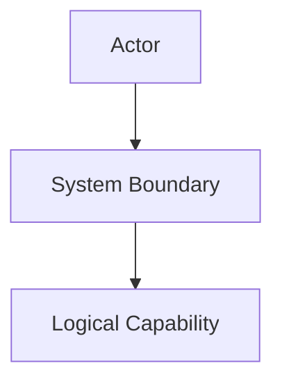

---
orderspec:
  artifact: spec
  slug: "__FEATURE_SLUG__"
  feature_id: "__FEATURE_ID__"
  status: draft
  refs:
    framework_rules: ".orderspec/framework/orderspec-rules.md"
    constitution: "constitution.md"
    stack: "stack.md"
    architecture: "architecture.md"
    conventions: "conventions.md"
  generator:
    command: order.spec
    model: "__MODEL_NAME__"
---

# Software Design Document & Feature Specification: [FEATURE NAME]

**Feature ID**: `__FEATURE_ID__`
**Feature Directory**: `__FEATURE_DIRECTORY__`
**Created**: [DATE]
**Status**: Draft
**Input**: User description: "$ARGUMENTS"

## 1. Executive Summary

Brief high-level description of the feature, system behaviour, and contract intent.

Keep this section concise. Maximum 5–10 paragraphs.

---

## 2. Goal & Scope

- **Objectives:** [What business or technical problem is being solved]
- **Out of Scope:** [Explicitly excluded items]

### Success Criteria

<!-- Measurable, technology-agnostic outcomes verifiable after release. No stack, library, file path, or implementation details. -->

- **SC-001**: [Observable success criterion]
- **SC-002**: [Observable success criterion]

### Cross-Spec Dependencies

#### Provides

<!-- Contracts this spec defines that other specs may depend on. Omit this subsection entirely if this feature provides no reusable contracts. -->

| Contract ID | Type | Summary | Stability |
|-------------|------|---------|-----------|
| `__FEATURE_ID__:REQ-001` | Requirement | [One-line description] | Stable |

#### Consumes

<!-- Contracts from other feature specs that this feature depends on. Omit this subsection entirely if there are no cross-feature dependencies. -->

| Edge | Target | Required | Reason |
|------|--------|----------|--------|
| `requires` | `FEAT-001-user-auth:IF-001` | yes | [Why this dependency exists] |
| `uses` | `FEAT-002-pagination:IF-001` | no | [Why this dependency exists] |

<!-- If a dependency does not yet exist, mark it [UNRESOLVED: <feature-id>:<id> — reason] and list it in §13. -->

---

## 3. Glossary

<!-- Domain terms only. Omit obvious engineering terms. -->

| Term | Definition |
|------|------------|
|      |            |

---

## 4. Functional Requirements

<!-- One testable WHAT statement per REQ. Use MUST/MUST NOT. Do not include implementation strategy. -->

- **REQ-001**: System MUST [specific observable capability].
- **REQ-002**: System MUST [specific observable capability].

---

## 5. Non-Functional Requirements

<!-- Performance, security, privacy, retention, reliability, accessibility, and observability requirements.
Do not invent quantitative thresholds. Do not mention technology names, library names, versions, file paths, class names, plugins, or query syntax. Use §6 for project contract ID references. -->

- **NFR-001**: System MUST [measurable non-functional requirement only if user/project supplied the threshold].
  - **Source**: [valid `GOV/STACK/ARCH/CONV-NNN` or `user-request`]
- **NFR-002**: System SHOULD [qualitative non-functional expectation].

---

## 6. Project Constraints Applied

<!-- Reference project contract IDs only, with short neutral labels.
Do NOT copy technology names, versions, library names, file paths, class names, plugin names, or query syntax into spec.md.

Allowed examples:
- `STACK-001` — runtime constraint
- `STACK-003` — persistence constraint
- `ARCH-001` — architecture constraint
- `CONV-001` — error-handling convention

Not allowed examples:
- `STACK-001` — Node.js 20.x
- `STACK-003` — MongoDB 6.x
- `CONV-004` — Mongoose timestamps plugin

Every referenced ID must exist in the corresponding project contract:
STACK-NNN → stack.md
ARCH-NNN → architecture.md
CONV-NNN → conventions.md -->

- `STACK-001` — [neutral project stack constraint label]
- `ARCH-001` — [neutral architecture constraint label]
- `CONV-001` — [neutral convention label]

---

## 7. Architecture & Behaviour

<!-- Choose the minimal set of Mermaid diagrams needed to describe the logical contract.
Use logical roles, not physical code names.
At minimum, include one diagram showing actor-system interaction or data flow.
Omit non-applicable diagrams entirely. Never emit placeholder diagrams.

Mermaid safety:
- Flowchart node labels use quoted form: A["label"]
- sequenceDiagram participants are declared at the top via participant lines. -->



---

## 8. Information Model

<!-- Logical entities, structures, and value sets only.
No database column types, ORM annotations, library names, plugin names, file paths, or implementation details.
Omit this entire section if no data model exists. -->

### Entity: [EntityName]

| Field | Type | Required | Default | Mutable | Notes |
|-------|------|----------|---------|---------|-------|
|       |      |          |         |         |       |

### Structure: [StructureName]

| Field | Type | Required | Notes |
|-------|------|----------|-------|
|       |      |          |       |

### Value Set: [ValueSetName]

| Value | Description |
|-------|-------------|
|       |             |

---

## 9. Interface Contracts

<!-- Each externally observable interaction boundary gets an IF-NNN record with a structured Field/Value table.
Interface means HTTP endpoint, GraphQL operation, CLI command, UI action, event publication/subscription, webhook, file import/export, scheduled trigger, SDK operation, or other interaction surface.

§9 is the single normative source for status codes and response shapes.
Define repeated structures only when used by one or more IF records.
Do not include placeholder interfaces in final specs. -->

### Authorization

<!-- If the feature has mutating interfaces or cross-tenant reads, specify actor and permissions per interface.
Omit this subsection if not applicable. -->

### Shared Structures

<!-- Define repeated structures only when used by one or more IF records. Omit this subsection if not applicable.

Example optional structures:
- Pagination Envelope
- Error Body
- Audit Event
- Import Result
-->

### Interfaces

- **IF-001**: [Operation Name].

  | Field | Value |
  |-------|-------|
  | Kind | [HTTP endpoint / Event publication / CLI command / UI action / ...] |
  | Operation | [Human-readable operation name] |
  | Address | [Method+path, event name, command syntax, UI action name, or omit if not applicable] |
  | Actor | [Who or what triggers this interface] |
  | Input | [Input structure name or description] |
  | Success | [Outcome on success, including status code if HTTP] |
  | Failure | [Failure outcomes] |
  | Covers | REQ-001 |

<details>
<summary>Payload Schemas</summary>

```json
{
  "request": {},
  "response": {}
}
```

</details>

---

## 10. Invariants

<!-- Conditions that must hold true at all times. Absolute form only.
Do not use "unless", "if fails", "best-effort", or operational exceptions in invariants.
Operational exceptions belong in REQ, DEC, or ASM. -->

- **INV-001**: [Absolute consistency rule].

### Contradiction Grid

<!-- Required. For each INV with absolute quantifier, check against NFR/ASM weakening qualifiers.
Also include REQ × ASM narrowing pairs when applicable.
If no pairs exist, state: "No absolute INV × weakening NFR/ASM pairs." -->

| Pair | Source | Tension | Verdict |
|------|--------|---------|---------|
| INV-001 × NFR-001 | [quote/source] | [reason] | compatible |

---

## 11. Edge Cases

- **EDGE-001**: [Boundary condition, failure, race, or unusual input].
- **EDGE-002**: [Boundary condition, failure, race, or unusual input].

---

## 12. Acceptance Criteria & User Journeys

<!-- Each UJ is an independently implementable and testable slice, ordered P1..Pn.
At most 2 UJs may be P1.
Every AC MUST have inline [Covers: ...] tracing to specific REQ/IF IDs. -->

- **UJ-001**: [Brief Title] (Priority: P1)
  **Covers**: REQ-001, REQ-002, IF-001
  **Why this priority**: [...]
  **Independent Test**: [...]
  **Done when**: [observable outcome]

  - **AC-001**: [Covers: REQ-001, IF-001] **Given** [state], **When** [action], **Then** [outcome].
  - **AC-002**: [Covers: REQ-002, IF-001] **Given** [state], **When** [action], **Then** [outcome].

---

## 13. Open Questions

<!-- Blocking questions must be resolved before a spec is ready for /order.plan.
Use Q-NNN only for non-blocking unresolved references or explicitly deferred issues that do not affect scope, security, privacy, acceptance, IF, INV, REQ, or NFR semantics. -->

- **Q-001**: [Non-blocking open question, or remove this section content and state "None — all requirements are unambiguous and scoped."]

---

## 14. Decisions

<!-- Resolved decisions that materially affect an interface contract (IF) or invariant (INV).
Each DEC entry MUST have an Affects line pointing to at least one IF or INV.
If no decisions exist, state "None." -->

- **DEC-001**: [Decision statement].
  - **Affects**: `IF-001` ([what changed]), `INV-001` ([what changed])
  - **Rationale**: [Why this decision was made]

---

## 15. Assumptions

<!-- Resolved defaults that a competent reviewer would not contest.
These do not affect IF or INV wording.
Kind tags:
- [default]
- [narrowing REQ-NNN]
- [deferred]

If an assumption changes externally observable behaviour, promote it to DEC or reflect it in REQ/§9. -->

- **ASM-001**: [default] [Low-impact default].
- **ASM-002**: [narrowing REQ-001] [Narrowing default].

---

## 16. Changelog

<!-- Populated in refine mode.
Table format: one row per change.
Types: Added | Changed | Removed | Strengthened | Weakened | Moved | Split | Merged | Clarified | Renamed -->

| Date | Type | Change | IDs affected | Contract impact | Reason |
|------|------|--------|--------------|-----------------|--------|
|      |      |        |              |                 |        |
