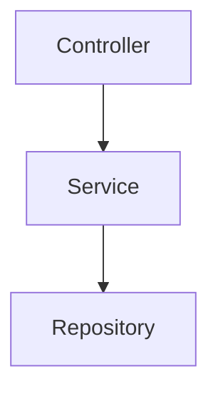

# Implementation Plan: [FEATURE]

**Branch**: `[###-feature-name]` | **Date**: [DATE] | **Spec**: [link to specs/[###-feature-name]/spec.md]

**Input**: Feature specification from `/specs/[###-feature-name]/spec.md`

## Summary

[Technical approach only; do NOT restate Executive Summary from spec]

## Technical Context & Stack Verification

**Language/Version**: [e.g., Kotlin 2.0, Python 3.11, Swift 5.9 or NEEDS CLARIFICATION]
**Primary Dependencies**: [Specific libraries needed for implementation]
**Storage**: [Target database/tables affected, matching Spec § Data Model (ERD)]
**Testing Framework**: [e.g., JUnit, pytest, XCTest]
**Target Platform**: [e.g., iOS 17+, Linux, Web/WASM]
**Test/Build Commands**: [verbatim commands from repository manifest/scripts, e.g. `yarn test`, `yarn lint`]
**Constraints Honored**: [List CON-IDs from spec; flag any conflict]
**NFR Focus**: [List NFR-IDs critical during coding — reference only, do not copy text]
**Verified Against**: [list of files actually read: package.json, src/models/user.model.js, ...]

## Constitution Check

Each gate status is one of: PASS (verifiable now, cite evidence), DESIGN-OK (the plan's design complies; enforcement happens at implement), FAIL (violation — justify in Complexity Tracking). Never mark PASS for properties of files that do not exist yet.
[Gates determined based on constitution file]

## Feature Artifacts Layout

```text
specs/[###-feature]/
├── spec.md              # Truth Source: requirements, logical architecture, data model, API contract
├── plan.md              # This file: physical file mapping, stack verification, implementation mechanisms
├── research.md          # CONDITIONAL: generated only if unresolved technology/design questions exist
└── tasks.md             # Generated later by /order.tasks: atomic execution order

```

If no research was needed, write below the tree:
`No research.md generated — all planning inputs were resolved from spec.md and repository reconnaissance.`

## Physical Project Structure (Source Code)

<!-- Annotate EVERY file: [NEW] = file to be created, [MOD] = existing file to be modified.
     Directories need no annotation. Every [MOD] path MUST exist in the repo at plan time;
     every [NEW] path MUST NOT exist. Do not list untouched files. The tree MUST be a single well-formed hierarchy: [MOD] files appear nested inside their parent directory alongside [NEW] files — never as a flat list appended after the tree. -->

```text
src/
├── models/
│   └── user.py                  [NEW]  User entity (Spec § Data Model)
├── services/
│   └── auth_service.py          [NEW]  Core logic for UJ-001
├── api/
│   └── routes.py                [MOD]  Register new endpoints (Spec § API Contracts)
└── config/
    └── settings.py              [MOD]  Add feature flag
tests/
└── integration/
    └── test_auth_flow.py        [NEW]  Asserts AC-001, AC-002
```

**Structure & Path Decisions**:

* **Target Folders:** [Which existing folders are affected; what new packages must be created]

* **File Naming Convention Evidence:**

| Layer | Observed Files | Convention | New Files |
| --- | --- | --- | --- |
| Models | [`...`] | [`...`] | [`...`] |
| Services | [`...`] | [`...`] | [`...`] |
| Controllers | [`...`] | [`...`] | [`...`] |
| Validations | [`...`] | [`...`] | [`...`] |
| Routes | [`...`] | [`...`] | [`...`] |
| Tests/Fixtures | [`...`] | [`...`] | [`...`] |

For multi-word entities: [same-layer precedent or explicit statement that no precedent exists, plus chosen convention and rationale].

* **Architectural Mapping:** [How Spec containers/components map to the folder layout above]

* **Mechanism Decisions:**

| Spec ID | Mechanism | Primary Files | Test Type |
| --- | --- | --- | --- |
| [AC/INV/EDGE/NFR/REQ ID] | [Concrete implementation decision; no contract restatement] | [`path/to/file.js`] | [unit / integration / —] |

* **Component Diagram:** Internal physical design of the planned implementation:


## Complexity Tracking

> **Fill ONLY if Constitution Check has violations that must be justified**

| Violation | Why Needed | Simpler Alternative Rejected Because |
| --- | --- | --- |
|  |  |  |
|  |  |  |