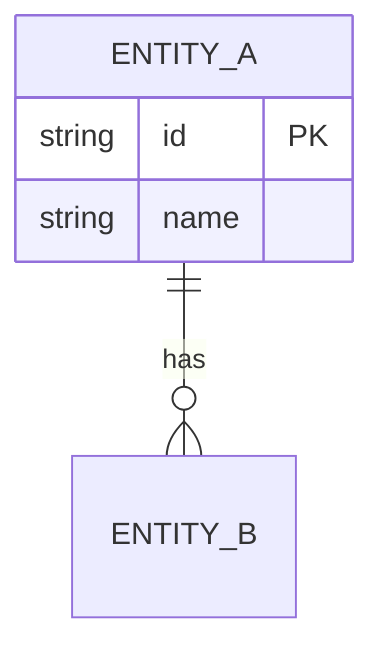

# Software Design Document & Feature Specification: [FEATURE NAME]

**Feature Branch**: `[###-feature-name]`
**Created**: [DATE]
**Status**: Draft
**Input**: User description: "$ARGUMENTS"

## 1. Executive Summary
Brief high-level description of the system, feature, or architectural change. (Max 5–10 paragraphs).

---

## 2. Goal & Scope
- **Objectives:** [What business or technical problem is being solved]
- **Out of Scope:** [Explicitly excluded items]

### Success Criteria
<!-- Measurable, technology-agnostic outcomes verifiable after release. No tech stack mentions. -->
- **SC-001**: [e.g., "Users complete account creation in under 2 minutes"]
- **SC-002**: [e.g., "Reduce support tickets related to X by 50%"]

---

## 3. Glossary
| Term | Definition |
| ---- | ---------- |
|      |            |

---

## 4. Functional Requirements
<!-- One testable statement per REQ (MUST/MUST NOT). -->
- **REQ-001**: System MUST [specific capability]
- **REQ-002**: System MUST [specific capability]

---

## 5. Non-Functional Requirements
- **NFR-001**: [e.g., API response time limits, throughput, concurrent users constraints]
- **NFR-002**: [e.g., Security, data retention or observability requirements]

---

## 6. Constraints
<!-- Externally imposed: mandated tech, platforms, compliance. This is the ONLY section where
     physical technology names (Mongoose, Joi, PostgreSQL) may appear. -->
- **CON-001**: [e.g., "Must use PostgreSQL"]
- **CON-002**: [e.g., "Must support iOS 17+"]

---

## 7. Architecture & Behaviour
<!-- Choose the MINIMAL set of Mermaid diagrams to fully describe the contract.
     Use LOGICAL ROLES (Authentication, Validation, Application Service, Persistence),
     NOT physical code names (Mongoose, Joi, Route Layer, catchAsync) from §6.
     At minimum, include one diagram showing actor-system interaction or data flow.
     Omit non-applicable diagrams entirely — never emit placeholder diagrams.
     Mermaid safety: ALL node labels MUST use quoted form X["label"].
     In sequenceDiagram, declare every participant at the top via participant X lines. -->

---

## 8. Data Model (ERD)
<!-- Omit entirely if not applicable. Verbose column details go in <details> blocks. -->


<details>
<summary>View Schema Details</summary>

| Field | Type | Required | Default | Description |
|-------|------|----------|---------|-------------|
|       |      |          |         |             |

</details>

---

## 9. API Contracts
<!-- Omit entirely if no external interface. §9 is the single normative source for status codes
     and response shapes. Define repeated structures ONCE in a shared <details> block;
     per-endpoint entries reference them. Include full examples only for non-obvious shapes. -->

### Authorization
<!-- If the feature has mutating endpoints or cross-tenant reads, specify actor and permissions
     per endpoint here. If unresolved, note "deferred to Clarification Protocol". Omit if not applicable. -->

### Shared Structures

<details>
<summary>Pagination Envelope</summary>

```json
{
  "results": [],
  "page": 1,
  "limit": 10,
  "totalPages": 1,
  "totalResults": 0
}
```

</details>

<details>
<summary>Error Body</summary>

```json
{
  "code": 400,
  "message": "Error description"
}
```

</details>

### Endpoints
- **POST** `/api/v1/...`

<details>
<summary>View JSON Payload Schemas</summary>

```json
{
  "request": {},
  "response": {}
}
```

</details>

---

## 10. Invariants
<!-- Conditions that must hold TRUE at all times (consistency rules), deterministic form.
     Not requirements, not behaviors. -->

- **INV-001**: [e.g., "Active session must have exactly one owner"]
- **INV-002**: [e.g., "Transaction amount cannot be negative"]

### Contradiction Grid
<!-- Required. For each INV with absolute quantifier (exactly/always/never) check against
     NFR and ASM with weakening qualifiers (best-effort/may fail/eventually).
     Also add REQ×ASM narrowing pairs if any ASM narrows a REQ's semantics.
     If no pairs exist, state "No absolute INV × weakening NFR/ASM pairs". -->

| INV | Source | Tension | Verdict |
|-----|--------|---------|---------|
|     |        |         |         |

---

## 11. Edge Cases
- **EDGE-001**: [e.g., User disconnects in the middle of processing]
- **EDGE-002**: [e.g., Boundary condition or concurrent update conflicts]

---

## 12. Acceptance Criteria & User Journeys
<!-- Each UJ = independently implementable & testable MVP slice, ordered P1..Pn.
     At most 2 UJs may be P1. Every AC must trace to a REQ via "Covers".
     Each AC must directly test the REQ whose behavior it checks. -->

- **UJ-001**: [Brief Title] (Priority: P1)
  **Covers**: REQ-001, REQ-002
  **Why this priority**: [...]
  **Independent Test**: [...]
  **Done when**: [observable outcome that proves this UJ is complete]

  - **AC-001**: **Given** [state], **When** [action], **Then** [outcome]
  - **AC-002**: **Given** [state], **When** [action], **Then** [outcome]

---

## 13. Open Questions
<!-- High-impact forks surfaced via Clarification Protocol. If none, state "None — all
     requirements are unambiguous and scoped." ONLY if you have verified Fork Awareness Areas. -->
- **Q-001**: [Pending architectural or business decision]

---

## 14. Assumptions
<!-- Kind tags: [default] = low-impact default; [narrowing REQ-NNN] = narrows a REQ's scope
     (must be verified case/action-aware against that REQ); [deferred] = decision deferred to plan.md.
     An ASM alone never carries behavior — if it changes observable behavior, also reflect in REQ or §9. -->
- **ASM-001**: [default] [e.g., "Existing auth system is reused"]
- **ASM-002**: [narrowing REQ-009] [e.g., "Snapshot captures full state, not diff"]

---

## 15. Changelog
<!-- Populated in refine mode. One line per change: date | change | IDs affected -->
<!-- Example: 2026-01-15 | Added REQ-010 for concurrent update semantics | REQ-010, INV-003 -->