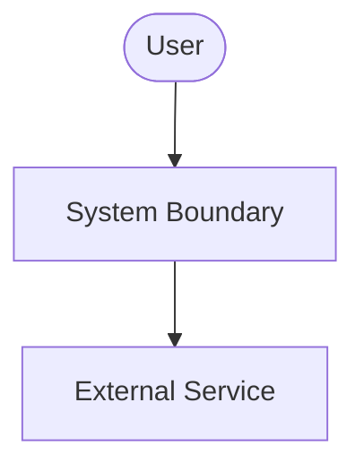
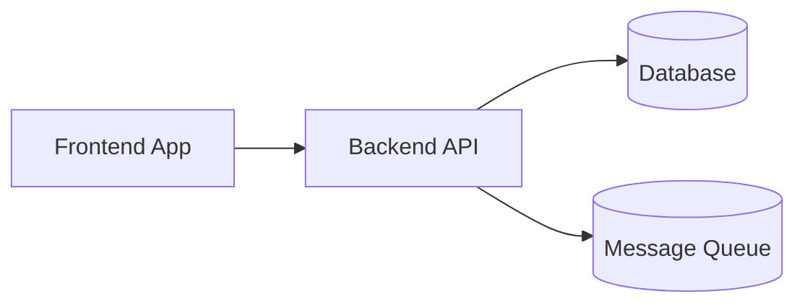
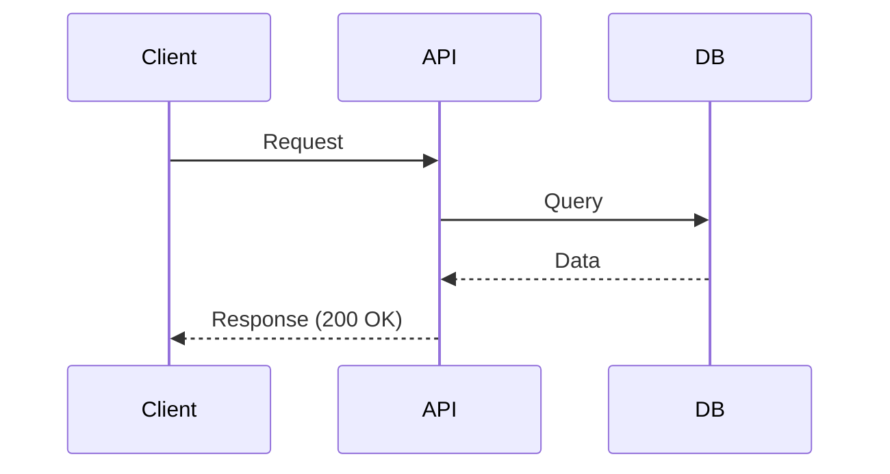
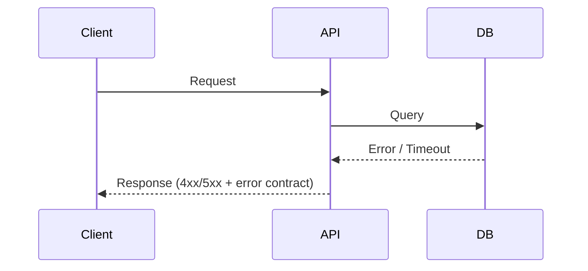
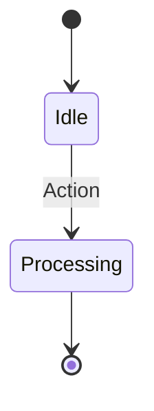
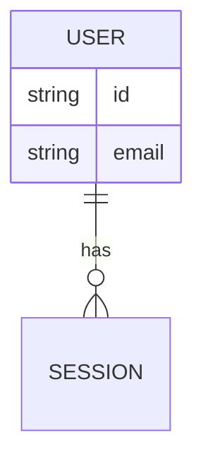

# Software Design Document & Feature Specification: [FEATURE NAME]

**Feature Branch**: `[###-feature-name]`
**Created**: [DATE]
**Status**: Draft
**Input**: User description: "$ARGUMENTS"

## 1. Executive Summary
Brief high-level description of the system, feature, or architectural change. (Max 5–10 paragraphs).

---

## 2. Goal & Scope
- **Objectives:** [What business or technical problem is being solved]
- **Out of Scope:** [Explicitly excluded items]

### Success Criteria
<!-- Measurable, technology-agnostic outcomes verifiable after release. No tech stack mentions. -->
- **SC-001**: [e.g., "Users complete account creation in under 2 minutes"]
- **SC-002**: [e.g., "Reduce support tickets related to X by 50%"]

---

## 3. Glossary
| Term | Definition |
| ---- | ---------- |
|      |            |

---

## 4. Functional Requirements
<!-- One testable statement per REQ (MUST/MUST NOT). If ambiguous: [NEEDS CLARIFICATION: question] + paired Q-NNN in Open Questions. -->
- **REQ-001**: System MUST [specific capability]
- **REQ-002**: System MUST [specific capability]

---

## 5. Non-Functional Requirements
- **NFR-001**: [e.g., API response time limits, throughput, concurrent users constraints]
- **NFR-002**: [e.g., Security, data retention or observability requirements]

---

## 6. Constraints
- **CON-001**: [e.g., "Must use PostgreSQL"]
- **CON-002**: [e.g., "Must support iOS 17+"]

---

# Architecture

## 7. System Context Diagram


## 8. Container Diagram
*(omit this section entirely if not applicable — do not create placeholder diagrams)*


---

# Behaviour

## 9. Sequence Diagrams

### Happy Path


### Error Paths
<!-- One diagram per significant failure scenario (validation failure, timeout, dependency down).
     Cover at least the failures referenced by EDGE-NNN that involve cross-component interaction.
     If no meaningful error flows exist, replace this subsection with one line: "No distinct error flows; errors covered by EDGE-NNN handling." -->


## 10. State Machine Diagram
*(omit this section entirely if not applicable — do not create placeholder diagrams)*


---

# Data & Contracts

## 11. Data Model (ERD)
*(omit this section entirely if not applicable — do not create placeholder diagrams)*


<details>
<summary>View Database Columns & Implementation Details</summary>

```sql
-- Implementation-specific schemas or verbose column details go here
```
</details>

## 12. API Contracts
*(omit this section entirely if not applicable — omit if no external interface)*
### Endpoints / Event Schemas
- **POST** `/api/v1/...`

<details>
<summary>View JSON Payload Schemas</summary>

```json
{
  "request": {},
  "response": {}
}
```
</details>

---

# Consistency & Validation

## 13. Invariants
<!-- Conditions that must hold TRUE at all times (consistency rules), deterministic form. Not requirements, not behaviors. -->
- **INV-001**: [e.g., "Active session must have exactly one owner"]
- **INV-002**: [e.g., "Transaction amount cannot be negative"]

---

## 14. Edge Cases
- **EDGE-001**: [e.g., User disconnects in the middle of processing]
- **EDGE-002**: [e.g., Boundary condition or concurrent update conflicts]

---

## 15. Acceptance Criteria & User Journeys
<!-- Each UJ = independently implementable & testable MVP slice, ordered P1..Pn. Every AC must trace to a REQ via "Covers". -->
### UJ-001 - [Brief Title] (Priority: P1)
**Covers**: REQ-001, REQ-002, NFR-001
**Why this priority**: [...]
**Independent Test**: [...]

- **AC-001**: **Given** [state], **When** [action], **Then** [outcome]
- **AC-002**: **Given** [state], **When** [action], **Then** [outcome]

---

## 16. Open Questions
- **Q-001**: [Pending architectural or business decision]
- **Q-002**: [Handled via order.clarify / NEEDS CLARIFICATION if needed]

---

## 17. Assumptions
- **ASM-001**: [Default chosen when input was ambiguous, e.g., "Existing auth system is reused"]