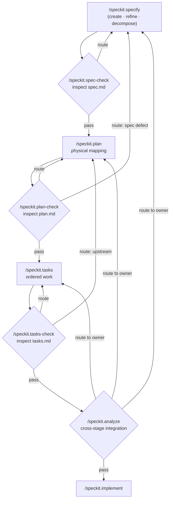
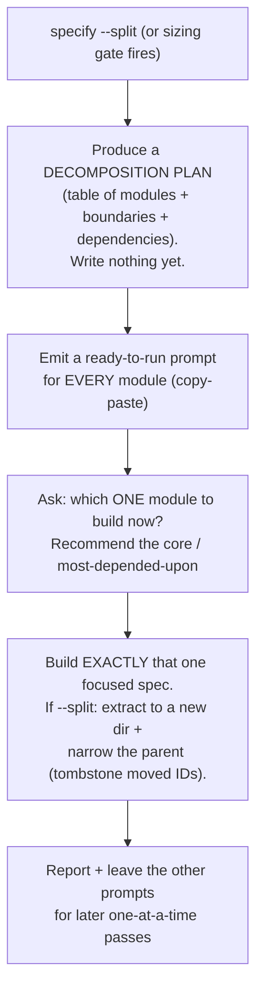
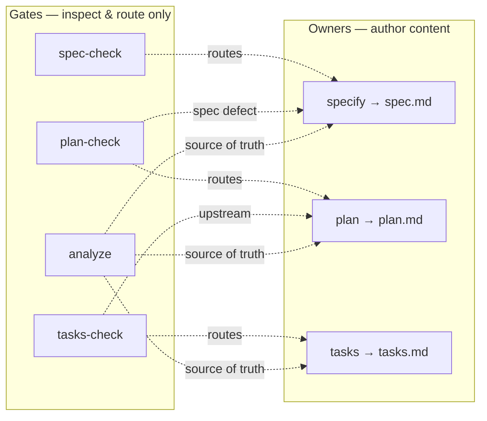

# OrderSpec

> Spec-Driven Development with **separated authorship and inspection** — a pipeline where one set of commands *writes* the contract and an independent set of gates *verifies* it, never silently rewriting it.

OrderSpec is a methodology + prompt set for building software from a stable **WHAT-contract** (`spec.md`) down through a physical plan (`plan.md`) and ordered tasks (`tasks.md`), with cheap, fresh-context **gates** between every stage. Its defining principle: **gates inspect, owners author.** A gate can fix a typo or a broken reference, but it can never invent a requirement, pick a threshold, delete scope, or regenerate an artifact behind your back. Anything contractual is *routed back* to the command that owns it.

This design exists for one reason: **to stay safe with weaker / cheaper models.** A gate run by a small model cannot quietly corrupt your contract, because it has no permission to write contract content — only to detect and route.

---

## Table of Contents

- [Core Philosophy (Model B)](#core-philosophy-model-b)
- [The Pipeline at a Glance](#the-pipeline-at-a-glance)
- [Commands](#commands)
- [The `specify` Command — Three Modes](#the-specify-command--three-modes)
- [The Four Gates](#the-four-gates)
- [Auto-Fix vs Route — the One Rule](#auto-fix-vs-route--the-one-rule)
- [Routing Blocks](#routing-blocks)
- [Verdicts](#verdicts)
- [Handling Oversized Specs (Decomposition)](#handling-oversized-specs-decomposition)
- [Typical Workflows](#typical-workflows)
- [Document Ownership Map](#document-ownership-map)
- [The Mechanical Script](#the-mechanical-script)
- [Extension Hooks](#extension-hooks)
- [Design Invariants](#design-invariants)
- [FAQ](#faq)

---

## Core Philosophy (Model B)

OrderSpec separates two jobs that most SDD tools fuse together:

| Job | Who does it | Can it change contract meaning? |
|-----|-------------|-------------------------------|
| **Authoring** content | the owner command (`specify`, `plan`, `tasks`) | ✅ yes — this is its purpose |
| **Inspecting** content | the gate (`*-check`, `analyze`) | ❌ never — it detects and routes |

A gate is a **pure inspector with a single, narrow write permission**: it may apply only **mechanical / meaning-preserving** fixes. Everything that touches meaning, threshold, scope, a missing topic, or a source-of-truth decision is surfaced as a **Routing block** pointing at the owner command.

> **When in doubt, a gate routes — it never authors.** That is the whole safety model.

The most important consequence: **`analyze` can never delete or regenerate an artifact.** A cascade rollback ("the spec changed, so plan and tasks must be redone") is emitted as an *ordered sequence of owner commands you run*, not an action the gate performs. The safeguard is structural, not a rule a weak model could ignore.

---

## The Pipeline at a Glance



Gates are **conditional**, not mandatory. On a clean single-session run by a capable model they're usually green and can be skipped. They earn their keep when an artifact was hand-edited, time passed between stages, or a weaker model generated something downstream.

---

## Commands

| Command | Type | Owns | Reads |
|---------|------|------|-------|
| `/speckit.specify` | **owner** | `spec.md` content (the WHAT-contract) | constitution |
| `/speckit.spec-check` | gate | — (inspects spec) | `spec.md`, checklist (RO), constitution |
| `/speckit.plan` | **owner** | `plan.md` content (physical mapping) | `spec.md`, repo |
| `/speckit.plan-check` | gate | — (inspects plan) | `spec.md`, `plan.md`, repo |
| `/speckit.tasks` | **owner** | `tasks.md` content (ordered work) | `plan.md`, `spec.md` |
| `/speckit.tasks-check` | gate | — (inspects tasks) | `spec.md`, `plan.md`, `tasks.md` |
| `/speckit.analyze` | gate | — (cross-stage integration) | all three + repo + constitution |
| `/speckit.implement` | executor | the codebase | all artifacts |

> `clarify` is gone. Its question-and-answer elicitation now lives inside `/speckit.specify` (the Quality Validation flow), where authoring belongs.

---

## The `specify` Command — Three Modes

`/speckit.specify` is the **sole owner of contract content**. It auto-detects its mode *before touching the filesystem*:

<details open>
<summary><b>create</b> — no active spec (or only an untouched template)</summary>

Fills the SDD template section by section, assigns stable IDs, validates against the quality checklist. **Refuses to overwrite** an existing non-template `spec.md` — if one exists, it re-routes itself to `refine`.

```bash
/speckit.specify "users can reset their password via an emailed one-time link"
/speckit.specify --new "a separate billing module"   # force create even if a spec exists
```
</details>

<details>
<summary><b>refine</b> — an active spec exists and the request is a change/addition/clarification</summary>

Edits the contract **surgically**, never regenerates it. This is what makes contract changes *reliable*:

- **IDs are append-only** — new statements get the next free number; existing IDs are never renumbered or reused.
- **Mirror** — a meaning change propagates to every dependent AC / EDGE / INV / diagram / contract code.
- **Coverage sweep** — the touched area is re-walked so nothing is left half-covered.
- **Reference reconciliation** — every `Covers:` / `→ covered by` / contract code still resolves.
- **Tombstones** — removing scope moves the ID to §2 Out-of-Scope with a reason, never a silent delete.
- **Changelog** — a dated line records what changed.

```bash
/speckit.specify "add rate-limiting to the login endpoint, 5 attempts per minute"
/speckit.specify "the AC for REQ-007 should also cover the expired-token case"
```
</details>

<details>
<summary><b>decompose</b> — the request (or existing spec) is too broad for one cohesive contract</summary>

See [Handling Oversized Specs](#handling-oversized-specs-decomposition). Triggered by `--split`, or automatically when the scope-sizing heuristic fires.

```bash
/speckit.specify --split        # break the current oversized spec into sub-specs
```
</details>

---

## The Four Gates

All four share one shape: **import the script's mechanical findings → run LLM detection passes → auto-fix the mechanical, route the contractual → emit a verdict.** They differ only in *what* they inspect.

| Gate | Question it answers | Routes to |
|------|--------------------|-----------|
| **`spec-check`** | Is `spec.md` a complete, consistent, testable contract — *independent of how it's built*? Is it cohesive (not oversized)? | `/speckit.specify` |
| **`plan-check`** | Is `plan.md` a correct, complete physical mapping of the contract onto the repo *as generated*? | `/speckit.plan` (or `/speckit.specify` for spec-rooted defects) |
| **`tasks-check`** | Is `tasks.md` a faithful, well-ordered, fully-covering projection of the plan? | `/speckit.tasks` (or upstream owner) |
| **`analyze`** | Are spec, plan, tasks, repo & constitution mutually consistent *right now*? (drift, staleness, cross-artifact contradictions, whole-system constitution) | the owner of whichever layer is the source of truth |

**Boundaries are strict and non-overlapping:**

- `spec-check` is the **root** — never reads the repo, the plan, or reasons about time.
- `plan-check` reads the repo as the **generation baseline** — it asks "was the plan planned correctly?", not "has the repo drifted since?".
- `tasks-check` is **local** — only spec (for IDs) + plan (the decisions) + tasks; no repo, no time.
- `analyze` owns the **irreducible cross-stage layer** no single-document gate can see: temporal drift, repo-staleness, contradictions *between* documents, and a defense-in-depth whole-system constitution re-check.

---

## Auto-Fix vs Route — the One Rule

Every gate applies the same boundary. A finding is **auto-fixed** only when **all four** hold:

1. the defect is **mechanical or strictly meaning-preserving**,
2. **exactly one** valid correction exists,
3. it does **not** change meaning, threshold, or scope,
4. it is **obvious and reversible**.

Everything else is **routed**.

| Gate | Auto-fix (mechanical) | Route (owner authors) |
|------|----------------------|----------------------|
| `spec-check` | glossary spelling, numbering, broken internal ref, AC reformatted to G/W/T (conditions unchanged) | missing topic, untestable REQ, missing threshold, contradiction, undefined term, scope ambiguity, oversized scope |
| `plan-check` | verbatim-spec→ID reference, `[NEW]`/`[MOD]` annotation, unambiguous path typo | missing/inadequate mechanism, stack choice, `CON` violation, smuggled-in behavior |
| `tasks-check` | test↔code reorder, insert required GATE/verification task, fix `[US#]`/`[P]` tags, numbering | invented decision, true coverage gap, vague task w/o clear target, SC needing a new task, cross-story dependency |
| `analyze` | cross-artifact terminology drift, unambiguous stale-ID rename | source-of-truth drift, contradiction, repo-staleness, constitution conflict, **any cascade** |

> **Note on `tasks-check`:** its structural auto-fixes (reordering, inserting a GATE or verification task) are *methodology-driven*, not content choices — the E-M-C / test-first order is fixed by the methodology. **Creating or changing what a task *does* is always a Route.**

---

## Routing Blocks

When a gate can't auto-fix, it emits a **Routing block** — a batched, copy-pasteable handoff to the owner:

```
### Routing Required: {short title}

**Finding**: {what is wrong or missing}
**Location**: {ID / §section / path}
**Why owner, not gate**: {changes meaning/scope OR fills a missing topic — must go through the author}
**Impact if unresolved**: {what breaks downstream}
**Suggested direction**: {1–2 advisory candidate resolutions}
**Run**: `/speckit.specify "{ready-to-run request}"`
```

The `Run` line is a **recommendation, not an action**. The gate never executes it and never waits to apply an answer — there are no "ask-and-apply" mutations. You run it when you choose to.

---

## Verdicts

Every gate ends with one of:

| Verdict | Meaning |
|---------|---------|
| ✅ **PASS** | no contractual findings; auto-fixes applied; safe to proceed |
| 🔀 **ROUTING REQUIRED** | at least one Routing block exists — an owner pass is needed before the stage is clean |
| ⛔ **BLOCK** | a CRITICAL remains, or a HIGH affects MVP-scope — the pipeline should not advance |

BLOCK and ROUTING can **co-display** (`⛔ BLOCK — routing required`): a routed CRITICAL/HIGH still blocks until *you* resolve it through the owner. Gates are **idempotent** — re-running a clean artifact yields stable IDs, counts, and ✅ PASS.

**MVP-scope** = whatever is tied to the **P1** (highest) user-journey priority in spec §14/§15. A HIGH on MVP blocks; the same class off-MVP does not auto-block.

---

## Handling Oversized Specs (Decomposition)

When a contract is too broad for one cohesive spec, OrderSpec uses **guided decomposition (Option Г)** — never bulk-generation, never silent priority assignment.

Both sides detect oversize with the **same heuristic** (any two firing → oversized):

- ≳ **25–30** plausible REQ
- ≳ **3** independent functional domains that could ship/test separately
- ≳ **3** distinct primary actor sets with non-overlapping journeys
- \> **2** UJs that each look like a standalone P1-MVP rather than one end-to-end thread

> **Density ≠ oversize.** A dense but cohesive single domain stays one spec.

- **`spec-check` (pass C8)** *detects* oversize on an existing spec and emits **one** Routing block → `/speckit.specify --split` (severity MEDIUM — advisory, not a hard block).
- **`specify --split` / decompose mode** *acts*:



This keeps every pass **light enough for a weaker model** (one spec at a time), **safe** (nothing is written before you confirm), and **resumable** (the remaining modules are waiting as copy-paste prompts).

---

## Typical Workflows

<details open>
<summary><b>Greenfield feature</b></summary>

```bash
/speckit.specify "..."        # create the contract
/speckit.spec-check           # (optional) inspect — route any gaps back to specify
/speckit.plan                 # physical mapping
/speckit.plan-check           # (optional) inspect
/speckit.tasks                # ordered work
/speckit.tasks-check          # (optional) inspect
/speckit.analyze              # (optional) cross-stage integration before implement
/speckit.implement
```
</details>

<details>
<summary><b>Changing an existing contract</b></summary>

```bash
/speckit.specify "add 2FA enrollment to the login journey"   # refine: surgical edit, IDs append-only
# specify warns: plan.md / tasks.md may now be stale
/speckit.plan                 # re-align downstream
/speckit.tasks
/speckit.analyze              # confirm the whole system is consistent again
/speckit.implement
```
</details>

<details>
<summary><b>A gate found something — the route loop</b></summary>

```bash
/speckit.plan-check
# → 🔀 ROUTING REQUIRED: REQ-008 (P1) has no Mechanism Decision
#   Run: /speckit.plan "add a mechanism for REQ-008 password-reset token expiry"

/speckit.plan "add a mechanism for REQ-008 ..."   # owner authors the fix
/speckit.plan-check                               # re-run to confirm → ✅ PASS
```

The loop is always: **gate routes → you run the owner command → re-run the gate.** Batch multiple routed requests into one owner call when convenient.
</details>

<details>
<summary><b>Weaker-model workflow (automatic gates)</b></summary>

Wire gates as post-generation hooks so every artifact a small model produces is inspected immediately:

```yaml
# .specify/extensions.yml
hooks:
  after_specify: [{ command: speckit.spec-check, optional: false }]
  after_plan:    [{ command: speckit.plan-check, optional: false }]
  after_tasks:   [{ command: speckit.tasks-check, optional: false }]
```

Because gates can't author content, an inspection by a weak model is *safe by construction* — worst case it over-routes, never corrupts.
</details>

---

## Document Ownership Map



| Concern | Owner |
|---------|-------|
| What the system must do, contracts, data model, invariants | `spec.md` via `specify` |
| Mechanisms, paths, modules, stack, `[NEW]`/`[MOD]` | `plan.md` via `plan` |
| Ordered, test-first, E-M-C tasks | `tasks.md` via `tasks` |
| Mechanical IDs / coverage / paths / numbering | `validate-traceability.sh` |
| Per-document soundness | the matching `*-check` gate |
| Cross-document consistency over time | `analyze` |

---

## The Mechanical Script

Every gate first runs:

```bash
.specify/scripts/bash/validate-traceability.sh --json "$FEATURE_DIR"
```

It returns `summary`, `inventory`, `coverage`, and `findings` (IDs `M1`–`M14`): ID inventory, dangling references, numbering, `[P]` file-disjointness, `[NEW]`/`[MOD]` path existence, timestamp drift, the REQ→UJ→AC→Task chain. **Gates trust it and never re-count** mechanically — LLM tokens are spent only on meaning. If the script is missing, gates emit an `S0-001` "degraded mode" finding and do a brief manual spot-check.

---

## Extension Hooks

Hooks let you inject commands before/after any stage via `.specify/extensions.yml`:

- `before_*` / `after_*` per command (`before_specify`, `after_plan_check`, …).
- `enabled: false` disables a hook (absent = enabled).
- `optional: true` → suggested (printed for you to run); `optional: false` → mandatory (`EXECUTE_COMMAND:` emitted).
- Hooks with a non-empty `condition` are left to the HookExecutor; empty/absent condition = executable.

---

## Design Invariants

These hold across the **entire** prompt set:

- 🧱 **Gates never author content** — one narrow write permission (mechanical/meaning-preserving), nothing more.
- 🚫 **No ask-and-apply** — gates emit Routing blocks, never questions whose answers they write.
- 💥 **No autonomous destruction** — `analyze` cannot delete or regenerate; cascades are routed command sequences.
- 🔢 **IDs are append-only** — never renumbered, reused, or silently deleted; removals become tombstones.
- 🔁 **Idempotent** — a clean artifact re-validates to ✅ PASS with stable IDs.
- 🎯 **Detect, don't fill** — missing topics and oversize are *found* by gates, *authored* by owners.
- 🧮 **Mechanics → script, meaning → LLM** — no duplication of the script's counting work.
- ⏱️ **Time is `analyze`'s alone** — only `analyze` and `plan-check` touch the repo; only `analyze` reasons about drift.
- ⚖️ **`[P]` is never required** — under-parallelization is not a defect; sequential is always valid.

---

## FAQ

<details>
<summary><b>Why can't a gate just fix the missing requirement itself?</b></summary>

Because authoring a requirement is a *contract decision* — it changes what the system must do. If a gate (especially one run by a weak model) could do that, you'd lose the guarantee that your contract reflects *your* intent. Detection is cheap and safe; authoring is owned, deliberate, and auditable.
</details>

<details>
<summary><b>Do I have to run every gate?</b></summary>

No. Gates are conditional. On a clean run by a capable model they're usually green. Run them when an artifact was hand-edited, time passed between stages, a weaker model was involved, or you're about to spend on an expensive `/speckit.implement`.
</details>

<details>
<summary><b>What happened to <code>clarify</code>?</b></summary>

It was folded into `/speckit.specify`. Elicitation (the numbered Q1–Q3 flow) is an *authoring* activity, so it belongs to the owner of the contract, not to a separate command or a gate.
</details>

<details>
<summary><b>A gate said BLOCK but also ROUTING REQUIRED — what do I do?</b></summary>

Run the routed owner command to resolve the CRITICAL/HIGH finding, then re-run the gate. The BLOCK clears once the owner has authored the fix — the gate confirms it on the next pass.
</details>

<details>
<summary><b>My spec is huge but it's all one coherent domain. Will it force a split?</b></summary>

No. **Density is never oversize.** The decomposition heuristic fires on *independent* domains / actor sets / MVP threads — not on raw size. A big cohesive contract stays one spec (at most a LOW note).
</details>

---

<p align="center"><i>OrderSpec — owners author, gates inspect, nothing changes the contract behind your back.</i></p>
